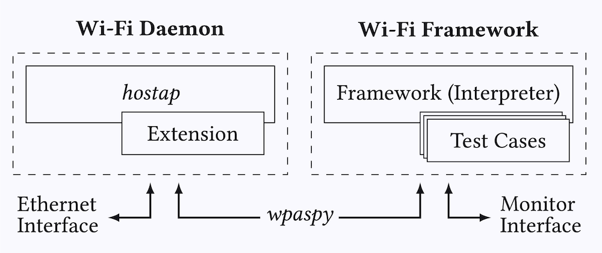

# Wi-Fi Framework

We present a framework to more easily perform Wi-Fi experiments.
It can be used to create fuzzers, implement new attacks, create proof-of-concepts to test for vulnerabilities, automate experiments, implement test suites, and so on.

The main advantage of the framework is that it **allows you to reuse Wi-Fi functionality of Linux to more easily implement attacks and/or tests**.
For instance, the framework can connect to (protected) Wi-Fi networks for you and can broadcast beacons for you when testing clients.
In general, any Wi-Fi functionality of Linux can be reused to more quickly implement attacks/tests.
The framework accomplishes this by executing _test cases_ on top of the _hostap_ user space daemon.

<p align="center">
	
	<br />
	<em>Overview of the Wi-Fi Daemon and Framework components.</em>
</p>

If you are new to performing Wi-Fi experiments on Linux it is highly recommended to first read the [libwifi Linux Tutorial](https://github.com/vanhoefm/libwifi/blob/master/docs/linux_tutorial.md).
When you are implementing basic Wi-Fi attacks without the need to reuse Linux functionality, then the framework provides limited advantages and you can instead consider directly implementing attacks in Scapy and optionally use the [libwifi](https://github.com/vanhoefm/libwifi) library.


## Usage

To use the framework:

1. Install it by running `./setup.sh`. See [setup](setup) to know what this script does.

2. Read the [usage tutorial](docs/USAGE.md).


<a id="id-example"></a>
## Example

Say you want to test whether a client ever encrypts frames using an all-zero key.
This can happen during a [key reinstallation attack](https://www.krackattacks.com/#demo).
By using the framework you do not need to reimplement all functionality of an access point,
but only need to write the following test case:

```python
class ExampleKrackZerokey(Test):
	name = "example-krack-zero-key"
	kind = Test.Authenticator

	def __init__(self):
		super().__init__([
			# Replay 4-Way Handshake Message 3/4.
			Action( trigger=Trigger.Connected, action=Action.Function ),
			# Receive all frames and search for one encrypted with an all-zero key.
			Action( trigger=Trigger.NoTrigger, action=Action.Receive ),
			# When we receive such a frame, we can terminate the test.
			Action( trigger=Trigger.Received, action=Action.Terminate )
		])


	def resend(self, station):
		# Resend 4-Way Handshake Message 3/4.
		station.wpaspy_command("RESEND_M3 " + station.clientmac )


	def receive(self, station, frame):
		if frame[Dot11].addr2 != station.clientmac or not frame.haslayer(Dot11CCMP):
			return False

		# Check if CCMP-encrypted frame can be decrypted using an all-zero key
		plaintext = decrypt_ccmp(frame.getlayer(Dot11), tk=b"\x00"*16)
		if plaintext is None: return False

		# We received a valid plaintext frame!
		log(STATUS,'Client encrypted a frame with an all-zero key!', color="green")
		return True
```

The above test case will create an access point that clients can connect to.
After the client connects, a new 3rd message in the 4-way handshake will be sent to the client.
A vulnerable client will then start using an all-zero encryption key, which the test case automatically detects.

You can run the above test case using simulated Wi-Fi radios as follows:
```
./setup/setup-hwsim.sh 4
source setup/venv/bin/activate
./run.py wlan1 example-krack-zero-key
```

You can connect to the created access point to test it (network `testnetwork` with password `passphrase`):
```
./hostap.py wlan2
```

By changing the [network configuration](docs/USAGE.md#id-network-configuration) this AP can easily be configured to use WPA2 or WPA3 and/or can be configured to use enterprise authentication, without making any changes to the test case that we wrote!
Additional benifits of using the framework in this example are:

- No need to manually broadcast beacons
- The authentication and association stage is handled by the framework
- The WPA2 and/or WPA3 handshake is handled by the framework
- Injected packets will be automatically retransmitted by the Linux kernel
- Packets sent _towards_ the AP will be acknowledged
- Sleep mode of the client is automatically handled by the kernel
- ...

See [a detailed description of all our examples](docs/EXAMPLES.md) for more examples.


## Publications

This work was published at ACM Conference on Security and Privacy in Wireless and Mobile Networks (WiSec '21):

- [DEMO: A Framework to Test and Fuzz Wi-Fi Devices](https://dl.acm.org/doi/10.1145/3448300.3468261)


Works that have used this framework or a similar one:

- [FragAttacks: Fragmentation & Aggregation Attacks](https://github.com/vanhoefm/fragattacks)


